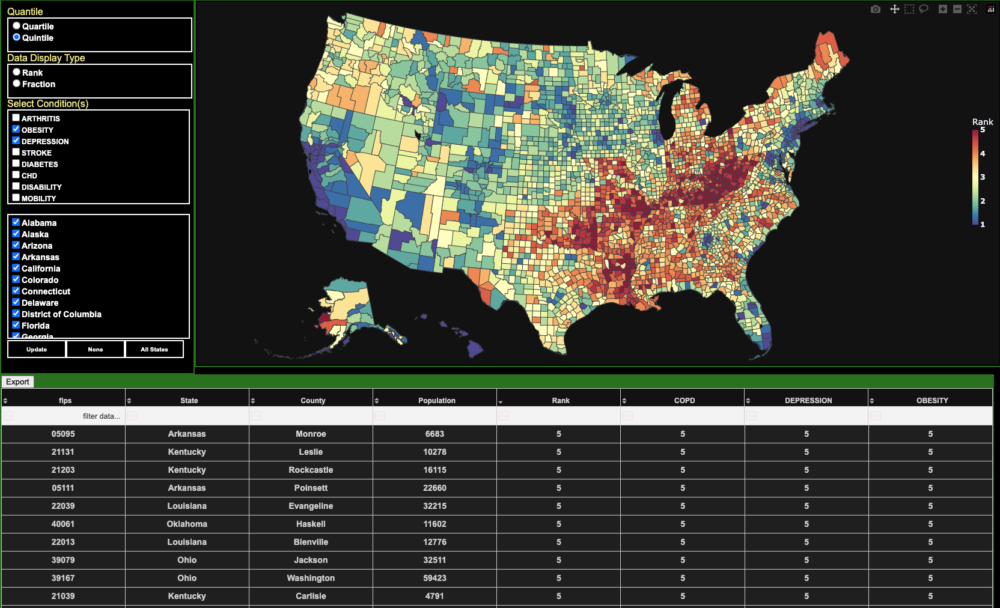

# 🗺️ CDC Chronic Disease Mapping Dashboard

**Author:** Molly Maskrey  
📊 Built with Dash + Plotly • ⚙️ Ray Parallel Compute • 🤖 OpenAI GenAI Interface

---

## 🚀 Overview

This project visualizes CDC chronic disease prevalence across the U.S. using a **scalable, interactive dashboard**. Unlike traditional BI tools like Tableau, this app is fully code-driven, lightning-fast (thanks to Ray), and conversational—powered by OpenAI for natural language querying.

---



## 🔧 Core Features

- 🧠 **Generative AI Assistant**  
  Ask natural questions like:
  > *"Which state has the highest diabetes rate?"*  
  > *"Show me maps of heart disease in the South."*

- ⚙️ **Ray-Powered Parallelism**  
  Fast preprocessing and filtering on large public health datasets

- 📈 **Dash + Plotly Frontend**  
  Interactive choropleths, filters, and ranking tools

- 🗂️ **Custom Ranking Engine**  
  Rank states or counties by prevalence, percentile, or raw count

- 📡 **Modular Data Handling**  
  Easily plug in new diseases, demographics, or time ranges

---

## 🗂️ Folder Structure

```
chronic-insight/
├── app.py
├── assets/
│   └── styles.css
└── data/
    └── us_counties.geojson   # or whatever filename you're using
```


## 🧠 Example AI Queries

You can ask the app:
- *"Which states have the highest rates of COPD?"*
- *"Compare diabetes rates in Texas and California."*
- *"What region has the highest cardiovascular risk?"*

The system uses OpenAI to interpret, map, and return visual and textual insights.

---

## ⚡ Setup Instructions

Install dependencies:
```bash
pip install dash plotly ray openai pandas geopandas

## ⚡ Run The App
python dash7par.py


You’ll need an OpenAI API key—store it as an environment variable OPENAI_API_KEY.
